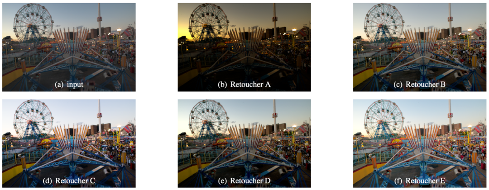

# MIT-Adobe FiveK dataset


## MIT-Adobe FiveK Dataset：MIT-Adobe美学增强数据集[^1]

[https://data.csail.mit.edu/graphics/fivek/](https://data.csail.mit.edu/graphics/fivek/)

`#Classification`  `#Multi-label`  `#Image enhancement`

> - 发布者：MIT CSAIL & Adobe Systems Inc.
> - 发布日期：2011
> - 样本数：5000
> - 分辨率：不固定（RAW）
> - 证书：[LicenseAdobe](https://data.csail.mit.edu/graphics/fivek/legal/LicenseAdobe.txt), [LicenseAdobeMIT](https://data.csail.mit.edu/graphics/fivek/legal/LicenseAdobeMIT.txt)




"We collected 5,000 photographs taken with SLR cameras by a set of different photographers. They are all in RAW format; that is, all the information recorded by the camera sensor is preserved. We made sure that these photographs cover a broad range of scenes, subjects, and lighting conditions. We then hired five photography students in an art school to adjust the tone of the photos. Each of them retouched all the 5,000 photos using a software dedicated to photo adjustment (Adobe Lightroom) on which they were extensively trained. We asked the retouchers to achieve visually pleasing renditions, akin to a postcard. The retouchers were compensated for their work."

---

### 目录

（文件太大，未全部下载）


### 备注

提供全部数据下载（～50GB）和单张图片下载，可写脚本部分下载某几张图片或某个专家调色后的图片。数据集包含以下信息：
- 图片格式为PNG（可通过DCRAW、Adobe lightroom或其他图像工具读取），调色后的图片保存为TIFF格式
- 提供5位后期专家Adobe Lightroom catalog文件，即包含了5位专家对每张图片的调色记录和各参数值
- 提供每张图片的语义信息标注（室内/室外、拍摄时段、光线、拍摄主题等）


### 引用

```
@inproceedings{fivek,
  author = "Vladimir Bychkovsky and Sylvain Paris and Eric Chan and Fr{\'e}do Durand",
  title = "Learning Photographic Global Tonal Adjustment with a Database of Input / Output Image Pairs",
  booktitle = "The Twenty-Fourth IEEE Conference on Computer Vision and Pattern Recognition",
  year = "2011"
}
```

### 联系方式

fivek-dataset@googlegroups.com


如未作特别说明，大部分公开数据集仅作为研究用途。


<br/>

[^1]: Bychkovsky, V., Sylvain Paris, E. Chan and F. Durand. Learning photographic global tonal adjustment with a database of input/output image pairs. [CVPR'11]
