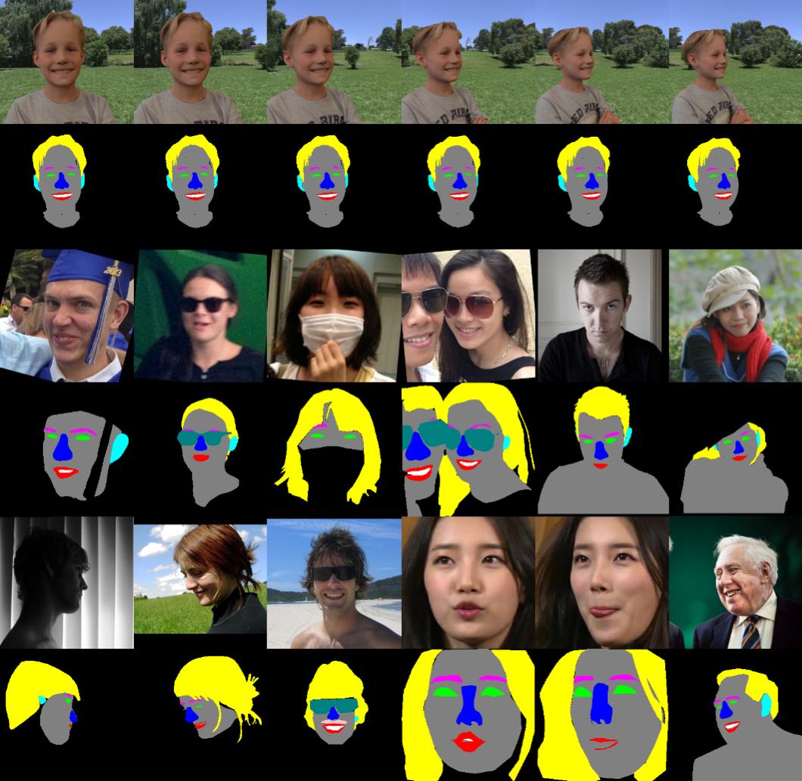
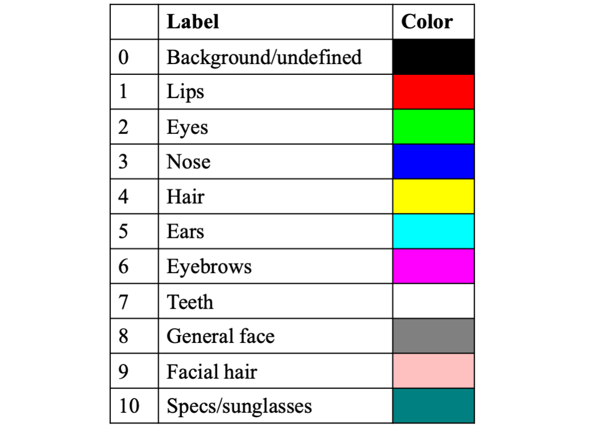

# Mut1ny Face Head Segmentation Dataset

## Mut1ny：头部/面部分割数据集[^1]

`#Segmentation`

> - 发布者：Mut1ny
> - 发布日期：2020.8
> - 样本数：16557
> - 类别数：11
> - 分辨率：300x280 / 304x304 / 256x256 / 其他
> - 证书：CC-BY-NC-SA

This new arrangement of the dataset contains over 16.5k (16557) fully pixel-level labeled segmentation images. Facial images are included from different ethnicity, ages and genders making it a well balanced dataset. Also there is a wide variety of facial poses and different camera angles to provide a good coverage from -90 to 90 degrees facing. Some images even contain multiple head/face segmentation depending on if the second or third face takes up enough screen real estate space.

### 目录

### 真值（~/labels）

不同类别的rgb颜色编码如下：

### 备注

2500张真实图像 (~/real_photos)，部分做旋转处理，分辨率大部分为304x304和256x256；其余14057张图像由23位志愿者（13男+10女）的面部在不同背景和角度下合成得到，分辨率为300x280。

### 额外的商业版本

目前标注好了44000张图像（至2021.1），新增了3个类别。可联系发布者提供。

### 联系方式

data@mul1ny.com


如未作特别说明，大部分公开数据集仅作为研究用途。


 

[^1]: https://www.mut1ny.com
