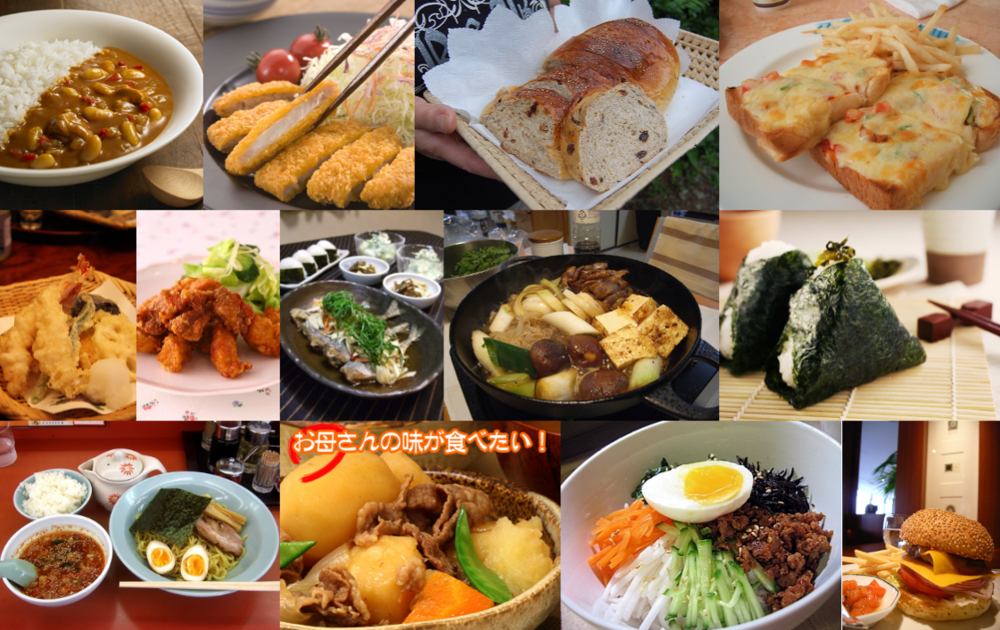
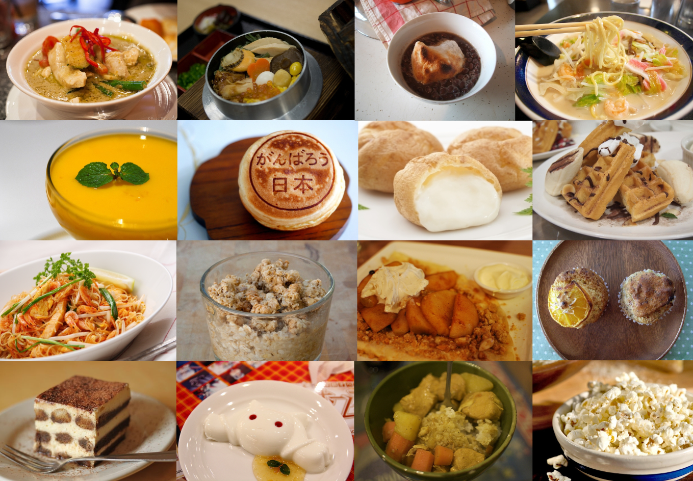
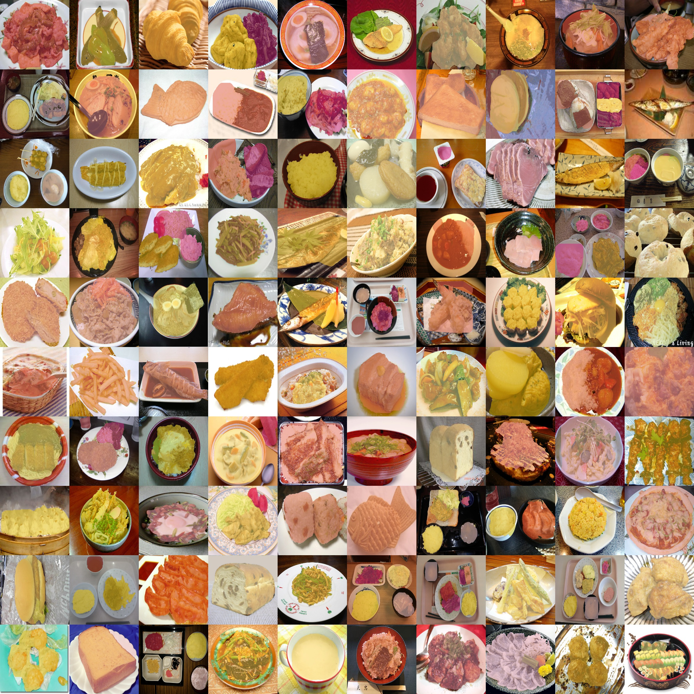

# UEC food datasets


## 1. UEC Food-100：食物识别数据集[^1]
[http://foodcam.mobi/dataset100.html](http://foodcam.mobi/dataset100.html)

`#Classification`  `#Recognition`  `#Multi-label`

> - 发布者：The University of Electro-Communications, Tokyo, Japan
> - 发布日期：2012
> - 样本数：16557
> - 类别数：100
> - 分辨率：不固定
> - 证书：Research Only




The dataset "UEC FOOD 100" contains 100-kind food photos. Each food photo has a bounding box indicating the location of the food item in the photo. Most of the food categories in this dataset are popular foods in Japan. Therefore, some catarogies might not be familiar with other people than Japanese.

---


## 2. UEC Food-256：食物识别数据集[^2]
[http://foodcam.mobi/dataset256.html](http://foodcam.mobi/dataset256.html)

#Classification  #Recognition

> - 发布者：The University of Electro-Communications, Tokyo, Japan
> - 发布日期：2014
> - 样本数：16557
> - 类别数：256
> - 分辨率：不固定
> - 证书：Research Only



The dataset "UEC FOOD 256" contains 256-kind food photos. Each food photo has a bounding box indicating the location of the food item in the photo. Most of the food categories in this dataset are popular foods in Japan and other countries. Therefore, some catarogies might not be familiar with other people than Japanese.

---

## 3. UECFoodPix/UECFoodPixComplete：食物分割数据集[^3][^4]

[http://mm.cs.uec.ac.jp/uecfoodpix/](http://mm.cs.uec.ac.jp/uecfoodpix/)

#Classification  #Segmentation

> - 发布者：The University of Electro-Communications, Tokyo, Japan
> - 发布日期：2020.7(UECFoodPix), 2020.10(UECFoodPixComplete)
> - 样本数：9000 (train) + 1000 (test)
> - 类别数：103
> - 分辨率：不固定
> - 证书：Research Only



UECFoodPix and UECFoodPixComplete are food images dataset with segmentation masks including 9,000 images for training and 1,000 image for testing. The Segmentation masks are augmented by food category. In UECFoodPix, the mask images is created using a bounding box and GrabCut, and In UECFoodPixCimplete there is provided manualy.The mask images have pixel-wise food 103 class labels, and only R(red) channel have this labels. 

---

### 目录

```
# UEC Food-100
UCEFOOD100/
　└[1-100]/            # 1-100类食物图片文件夹
　│　└*.jpg              # 属于该类的图片
　│　└bb_info.txt        # 该类所有图片的bouding box信息
　└category_ja_{euc, sjis, utf8}.txt  # 类别ID和对应标签（日文）
　└category.txt        # 类别ID和对应标签（英文）
　└multiple_food.txt   # 包含多标签的图片名和对应的类别ID
　└README.txt          # 说明文档
```

```
# UEC Food-256
UCEFOOD256/
　└[1-256]/            # 1-256类食物图片文件夹
　│　└*.jpg              # 属于该类的图片
　│　└bb_info.txt        # 该类所有图片的bouding box信息
　└category.txt        # 类别ID和对应标签（英文）
　└README.txt          # 说明文档
```

```
# UECFoodPixComplete
UECFOODPIXCOMPLTE/
├data/
　└UECFoodPIXCOMPLTE/
　　└train/           
　　│　└img/*.jpg        # 训练图片
　　│　└mask/*.png       # 训练图片分割Mask
　　└test/
　　│　└img/*.jpg        # 测试图片
　　│　└mask/*.png       # 测试图片分割Mask
　　└category.txt      # 类别ID和对应标签（英文）
　　└train.txt         # 训练数据（图片名）
　　└test.txt          # 测试数据（图片名）
```

### 备注

- UECFoodPix和UECFoodPixComplete包含相同的图像，不同在于分割Mask的生成方式不同，UECFoodPix中利用Bounding Box和GrabCut方法生成分割Mask，而在UECFoodPixComplete中分割Mask为手工标注。

- 其他食物数据集还有：UNIMIB Food, Food-475, VIREO, Food-101, and Food-50。

### 联系方式

food-group@mm.cs.uec.ac.jp 
(Prof. Keiji Yanai)


如未作特别说明，大部分公开数据集仅作为研究用途。


<br/>

[^1]: Matsuda, Y., H. Hoashi and K. Yanai. Recognition of Multiple-Food Images by Detecting Candidate Regions. [ICME'12]

[^2]: Kawano, Y. and K. Yanai. Automatic Expansion of a Food Image Dataset Leveraging Existing Categories with Domain Adaptation. [ECCV'14 Workshops]

[^3]: Ege, Takumi, Wataru Shimoda and K. Yanai. A New Large-scale Food Image Segmentation Dataset and Its Application to Food Calorie Estimation Based on Grains of Rice. [MADiMa'19]

[^4]: K. Okamoto and K. Yanai: UEC-FoodPix Complete: A Large-scale Food Image Segmentation Dataset. [MADiMa'21]


