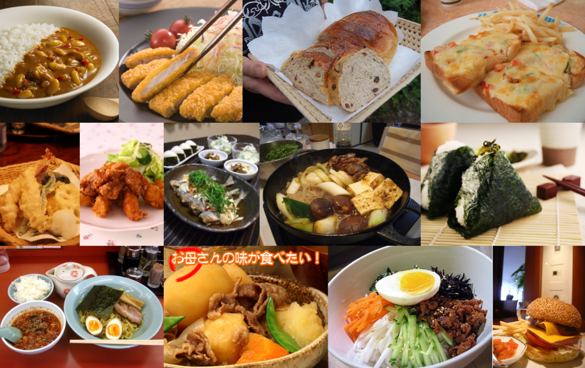

# LMSI 2｜UEC food datasets

## [LMSI 2｜UEC food datasets](http://foodcam.mobi/dataset100.html)

#Classification  #Recognition  #Multi-label

> 发布者：The University of Electro-Communications, Tokyo, Japan
>
> 发布日期：2012
>
> 样本数：16557
>
> 类别数：100
>
> 分辨率：不固定
>
> 证书：Research Only

The dataset "UEC FOOD 100" contains 100-kind food photos. Each food photo has a bounding box indicating the location of the food item in the photo. Most of the food categories in this dataset are popular foods in Japan. Therefore, some catarogies might not be familiar with other people than Japanese.

---

