# Mars32k dataset


## Mars32k：火星数据集[^1]

[https://dominikschmidt.xyz/mars32k/](https://dominikschmidt.xyz/mars32k/)

`#Unsupervised`

> - 发布者：NASA/JPL-Caltech
> - 发布日期：2018.11
> - 样本数：32368
> - 分辨率：560x500

|sample data||
|:-|-|
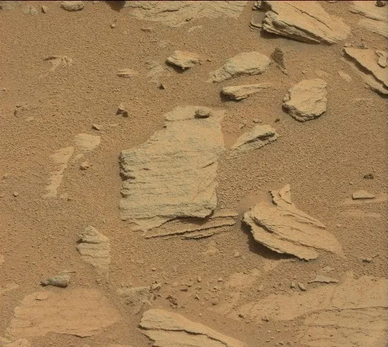|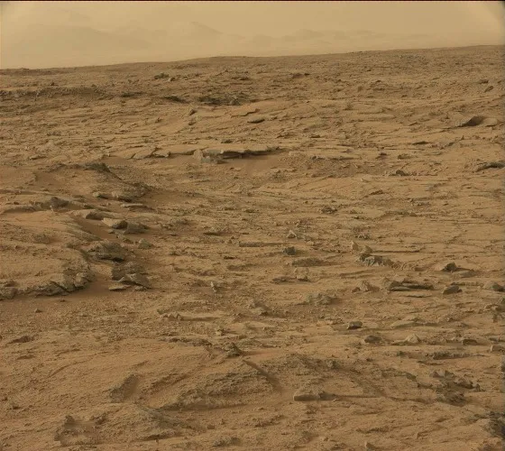
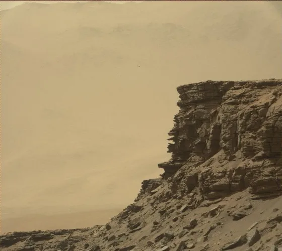|
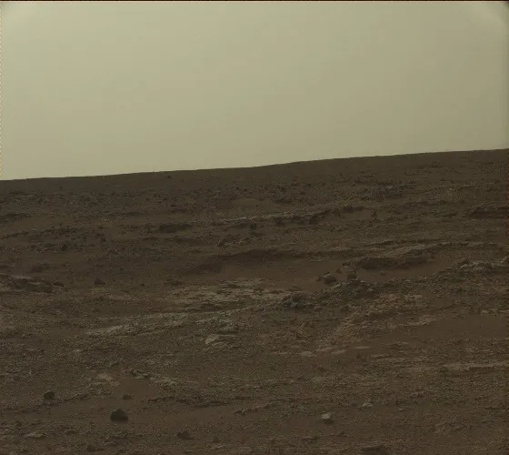|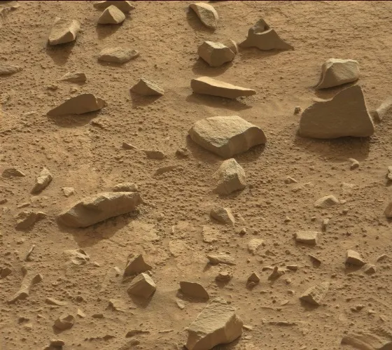
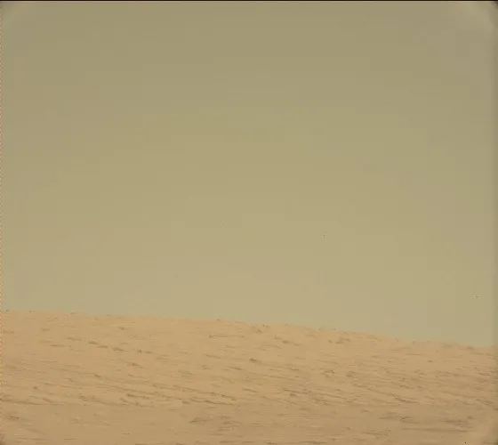|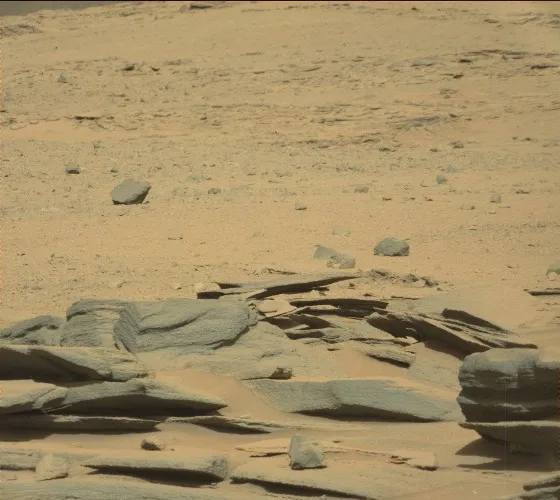
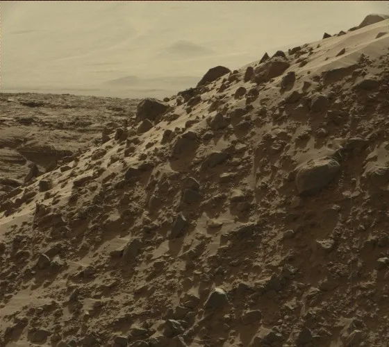|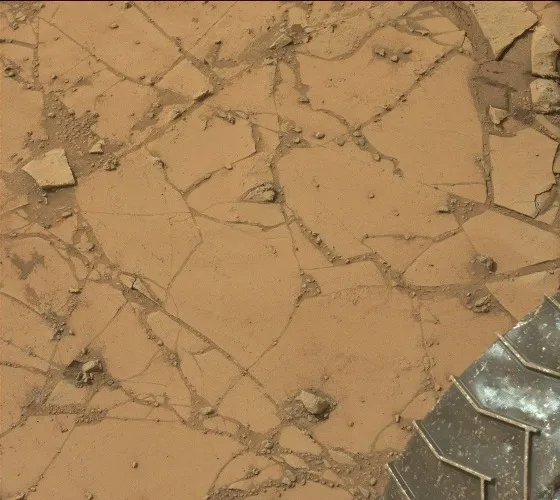
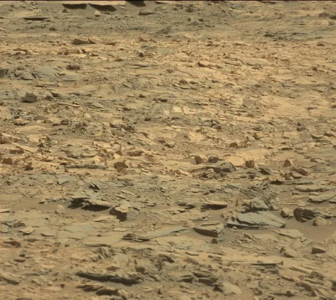|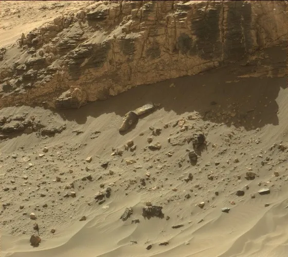
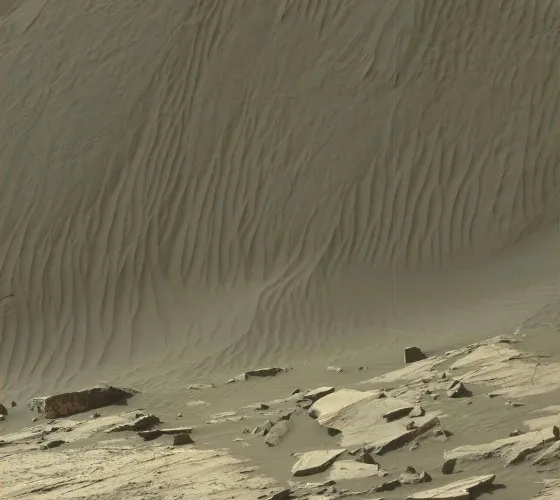|
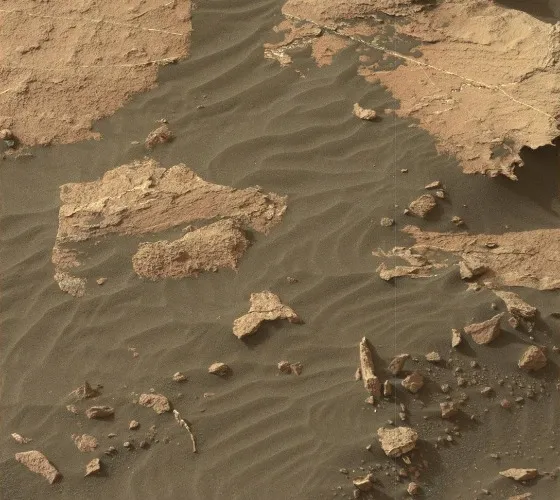|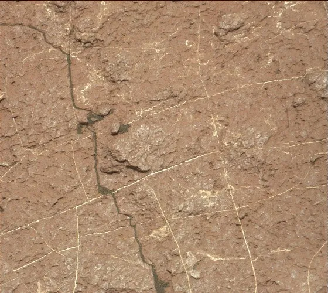

This dataset consists of about 32,000 color images collected by the Curiosity rover on Mars between August 2012 and November 2018. The images show various geographical and geological features of Mars such as mountains and valleys, craters, dunes and rocky terrain. All images have been scaled down using linear interpolation to 560x500px (some images have been cropped). The dataset is intended for unsupervised learning and the images are only labeled with the date they were taken on. This dataset only contains photos taken with Curiosity's Mastcam camera and all grayscale or other images were removed.

---

### 目录

```
mars32k/
　└[cr_]sol_nasa_filename.jpg

# 文件命名规则：
# cr_: 标记该图片已经过裁剪
# sol：标记拍摄这张图片的火星太阳日
# nasa_filename：标记NASA对该图片的命名
# 例如图片名称：725_0725MR0030950120402857E01_DXXX.jpg，
# 表示该图片未经过裁剪，拍摄于登陆火星的第725天，名称为0725MR0030950120402857E01_DXXX
```

### 备注
数据集中的图像并非原始分辨率，都经过了线性插值，统一调整为560×500px，这些图片显示了火星的各种地理和地质特征，如山脉和山谷，陨石坑，沙丘和岩石地形。该数据集可用于一些计算机图像任务，比如于物体检测模型的训练、模拟仿真3D火星表面模型的搭建，还能作为天文学科科普所用。

### 联系方式
schmidtdominik30@gmail.com


如未作特别说明，大部分公开数据集仅作为研究用途。


<br/>

[^1]: https://dominikschmidt.xyz/mars32k/
