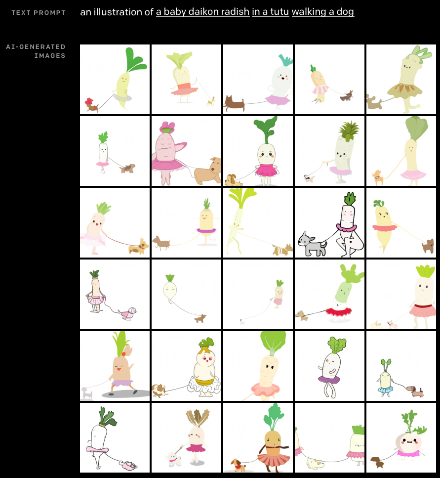

# 近期的摸鱼拾珠

## 炼丹技巧

### [All in Linux：一个算法工程师的IDE断奶之路](https://mp.weixin.qq.com/s?__biz=MzIwNzc2NTk0NQ==&mid=2247487528&idx=1&sn=2a716b4a76dcad37870ec766d518a445&chksm=970c38fea07bb1e8686dce80a03bb058dfa33a9d1daffbe7066312a8a2adcf4c917f76a29b40#rd)

> 在合格的炼丹师面前，python可能被各种嫌弃......
> 
> 夕小瑶，公众号：夕小瑶的卖萌屋

前段时间在远端部署OCR模型的时候，几度被无法与外网沟通的服务器搞得十分泄气。直到项目阶段性地告一段落后才看到这篇文章，真是深感相见恨晚，接下来可以实践一下了。

---

### [PyTorch常用代码段合集](http://mp.weixin.qq.com/s?__biz=MzIwNzc2NTk0NQ==&mid=2247497210&idx=2&sn=00cdd89328306001b0d16117d1a9c52f&chksm=970fdd2ca078543ab53b7cad6bcef745d62867331e3562400e475636c2eb1e98876f2af71776#rd)

> 本文是PyTorch常用代码段合集，涵盖基本配置、张量处理、模型定义与操作、数据处理、模型训练与测试等5个方面，还给出了多个值得注意的Tips，内容非常全面。
> 
> 公众号：夕小瑶的卖萌屋

炼丹常用的代码模板，可以在此基础上写一套适用自己的模板。

---

### [一文搞懂 PyTorch 内部机制](http://mp.weixin.qq.com/s?__biz=MzIwNzc2NTk0NQ==&mid=2247505474&idx=2&sn=e36e865ae68350e48b0e328a45c25886&chksm=970ffe94a0787782c9d0d928b5c80405f68f25f743c4ab017f422fe57891526479d43fd06ce4#rd)

> 这篇博文是一篇非常新的介绍PyTorch内部机制的文章，作者Edward Z Yang来自于Stanford大学，是PyTorch的核心开发者之一。文章中介绍了如何阅读PyTorch源码和扩展PyTorch的技巧。
> 
> ArchWalker，公众号：夕小瑶的卖萌屋

这是一篇好看的翻译文章，对于了解PyTorch底层的一些原理很有帮助[^1]。

---

### [AI识别彻底懵逼，这到底是「牛」还是「鲨」？](http://mp.weixin.qq.com/s?__biz=MzA5ODEzMjIyMA==&mid=2247566691&idx=1&sn=48aff8af178fe412b5171f1ada1532e6&chksm=9095ccf0a7e245e687bfa6aca3bca0ffe3842b066b405545516bbcd23d6a04e24e847f6a3b6a#rd)

> 我和编辑部的同事因为上图到底是牛还是鲨吵了起来图片，我说这张图更像图片，同事说更像图片，我们差点儿就GAN了一架！
> 
> 耳洞打三金，公众号：AI科技评论

关于是牛还是鲨的GAN架文章，故事告诉了我们人的视觉和机器识别模型存在的一些认知差异。

---

## 小程序

### [GeoPattern](https://github.com/jasonlong/geo_pattern)

用一个字符串生成SVG格式的图案，提供了多种语言的实现方式。用到了SHA算法，具体实现还需要再读一读源码。哦！想起来本周OpenAI极其可爱的[Dall-E](https://openai.com/blog/dall-e/)项目——用一串文本生成符合描述的图片，大佬们用[PyTorch的复现](https://github.com/lucidrains/DALLE-pytorch)也正在路上，有空可以玩一玩。

举几个GeoPattern的栗子：



再举一个Dall-E的栗子：

---

### [EDA (Easy Data Augmentation)](https://github.com/jasonwei20/eda_nlp)

最近在训练文本识别模型的时候，遇到了中文语料不足的问题，想到可以对现有的语料库做数据增强，于是发现了这篇应用于文本分类的数据增强论文——EDA: Easy Data Augmentation Techniques for Boosting Performance on Text Classification Tasks。其中的算法思想很朴素，作者提出了四种在原句子基础上进行调整的操作：随机插入、随机删除、随机交换和同义词替换，利用这种数据增强的方法可以在原模型基础上提高文本分类的准确率。

---

## 书籍

### [Kubernetes in Action 中文版](https://book.douban.com/subject/30418855/)

由七牛容器云团队翻译。最近在读，作为K8s的入门讲得针不戳。

---

### Google Python Style Guide

- [英文](https://google.github.io/styleguide/pyguide.html)
- [中文](https://google-styleguide.readthedocs.io/zh_CN/latest/google-python-styleguide/contents.html)

狗家也提供其他语言的styleguide可以参考。在团队协作的工程项目中把代码写规范还是很重要的，希望人人都可以献出一份爱，世界将充满更多毛绒绒的头发。

 

[^1]: 原文链接：http://blog.ezyang.com/2019/05/pytorch-internals/
