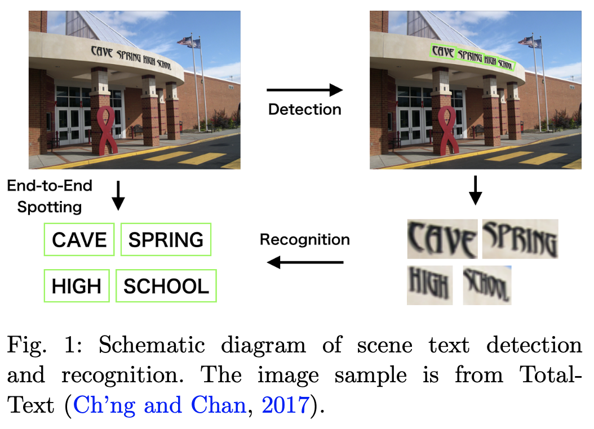
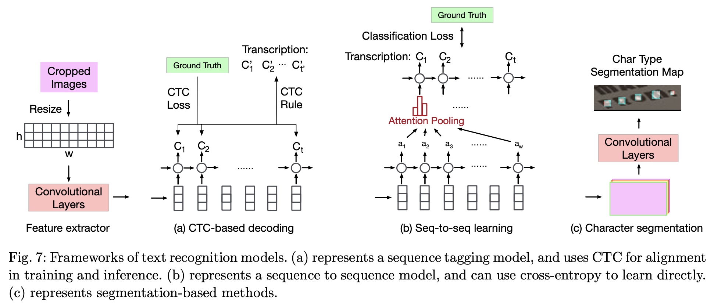

# 旷视文本检测与识别综述笔记

## Introduction

### Basic pipeline

- Detection+Recognition
- End-to-end

### Challenges for general text detection and recognition

- **Diversity and variability**
  - different languages/color/fonts/size/orientations/shapes
- **Complexity and interference of background**
  - similar patterns/occlusions
- **Imperfect image conditions**
  - Low resolution/shot angle/blurred(unfocused)/noise/light

## Methods before DL

### Text detection

- CCA (Connected Components Analysis)：连通域分析法

  1. 提取出包含文本的候选区域（color clustering/extreme region extration）
  2. 从候选区域中过滤背景，即分割出文本类（特征提取，分类/分割）

     - 特征：MSRE/SWT/SIFT/SURF/LBP/灰度共生矩阵等
     - 分类器：Kmeans/KNN/SVM/NN/DecisionTree等

[Huang et al., 2013](https://www.semanticscholar.org/paper/Text-Localization-in-Natural-Images-Using-Stroke-Huang-Lin/1d40b767d8c5ef7a93ca5cc5b0dbb850b8a0cd2e); [Neumann and Matas, 2010](http://cmp.felk.cvut.cz/~matas/papers/neumann-text-accv10.pdf); [Epshtein et al., 2010](http://cmp.felk.cvut.cz/~matas/papers/neumann-text-accv10.pdf); [Tu et al., 2012](http://pages.ucsd.edu/~ztu/publication/cvpr12_textdetection.pdf); [Yin et al., 2014](https://arxiv.org/pdf/1301.2628.pdf); [Yi and Tian, 2011](http://europepmc.org/backend/ptpmcrender.fcgi?accid=PMC3337634&blobtype=pdf); [Jain and Yu, 1998](https://www.computer.org/csdl/proceedings-article/icpr/1998/85121497/12OmNxFsmFT)

- SW (Siliding window)：滑动窗口法

  1. 利用不同大小的滑动窗口对窗口区域进行二分类（包含/不包含文本）
  2. 通过形态学操作/CRF/Graph-based-method等对窗口进行合并

[Lee et al., 2011](http://www.iapr-tc11.org/archive/icdar2011/fileup/PDF/4520a429.pdf); [Wang et al., 2011](https://vision.cornell.edu/se3/wp-content/uploads/2014/09/wang_iccv2011.pdf); [Coates et al., 2011](http://www.robotics.stanford.edu/%7Eang/papers/icdar01-TextRecognitionUnsupervisedFeatureLearning.pdf); [Wang et al., 2012](http://ai.stanford.edu/~ang/papers/ICPR12-TextRecognitionConvNeuralNets.pdf)

### Text recognition

- 基于特征的方法
- 划分子问题
  - 二值化(text binarization)->文本行切分(text line segmentation)->字符划分(character segmentation)->单字符识别(single character recognition)->单词校正(word correction)

**feature-based:** [Shi et al., 2013](http://sunw.csail.mit.edu/2013/papers/Shi_19_SUNw.pdf); [Yao et al., 2014](http://sunw.csail.mit.edu/2014/papers2/20_Yao_SUNw.pdf); Rodriguez-Serrano et al., [2013](https://pdfs.semanticscholar.org/fb6e/d6acbbca46ff94b9e349f991a8972c58ed28.pdf?_ga=2.69845136.1481050086.1604732797-2022411570.1604732797), [2015](https://link.springer.com/article/10.1007/s11263-014-0793-6); [Gordo, 2015](https://arxiv.org/pdf/1410.5224.pdf); [Almazan et al., 2014](http://www.cvc.uab.es/~afornes/publi/journals/2014_PAMI_Almazan.pdf)

**text binarization:** [Zhiwei et al., 2010](http://citeseerx.ist.psu.edu/viewdoc/download;jsessionid=087C9CF34CE27B0EC5FCC19D4BA01BF8?doi=10.1.1.182.198&rep=rep1&type=pdf); [Mishra et al., 2011](https://hal.inria.fr/hal-00817972/file/mishra11.pdf); [Wakahara and Kita, 2011](https://www.researchgate.net/publication/220930381_Binarization_of_Color_Characters_in_Scene_Images_Using_k-means_Clustering_and_Support_Vector_Machines); [Lee and Kim, 2013](https://www.sciencedirect.com/science/article/abs/pii/S0262885613001339?via%3Dihub)

**text line segmentation:** [Ye et al., 2003](https://ieeexplore.ieee.org/document/1292567/;jsessionid=gzuhwb7_25fOtNJSf9koNuIbIEbq8Bh5b6TCHBvzKE5iwq6fxdwd!747695510)

**character segmentation:** [Nomura et al., 2005](https://www.sciencedirect.com/science/article/abs/pii/S0031320305001251?via%3Dihub); [Shivakumara et al., 2011](https://www.semanticscholar.org/paper/A-New-Gradient-Based-Character-Segmentation-Method-Shivakumara-Bhowmick/a1cd044f6fe6ffd70ddaadc4df1b8e690a1cb256); [Roy et al., 2009](http://www.cvc.uab.es/icdar2009/papers/3725a011.pdf)

**single character recognition:** [Chen et al., 2004](https://www.csd.uwo.ca/~oveksler/Courses/Fall2012/CS9840/PossibleStudentPapers/RoadSigns2004.pdf); [Sheshadri and Divvala, 2012](https://pdfs.semanticscholar.org/541d/69fdf97e5ded611ad0dd46f62bb9d2e19a51.pdf?_ga=2.36873376.1481050086.1604732797-2022411570.1604732797)

**word correction:** [Zhang and Chang, 2003](https://www.ee.columbia.edu/ln/dvmm/publications/03/cvpr03_dongqing.pdf); [Wachenfeld et al., 2006](https://www.researchgate.net/publication/220932582_Recognition_of_Screen-Rendered_Text); [Mishra et al., 2012](http://www.bmva.org/bmvc/2012/BMVC/paper127/paper127.pdf); [Karatzas and Antonacopoulos, 2004](https://eprints.soton.ac.uk/263524/1/ICPR2004_Karatzas.pdf); [Weinman et al., 2007](https://weinman.cs.grinnell.edu/pubs/weinman07fast.pdf)

### End-to-end (detection+recognition)

- Wang et al., 2011：nearest-neighbor classifier+HoG
- Neumann and Matas, 2013：decision delay ap- proach+dynamic programming algorithm

[Wang et al., 2011](https://vision.cornell.edu/se3/wp-content/uploads/2014/09/wang_iccv2011.pdf); [Neumann and Matas, 2013](http://cmp.felk.cvut.cz/~matas/papers/neumann-2013-multisegmentation-icdar.pdf)

## Methods based on DL

### Text detection

- 早期尝试
- 基于目标检测的方法

  - Anchor-based

    - [TextBoxes (Liao et al., 2017)](https://www.aaai.org/ocs/index.php/AAAI/AAAI17/paper/download/14202/14295)：anchor-based, SSD [[code]](https://github.com/MhLiao/TextBoxes)
    - ***[EAST (Zhou et al., 2017)](https://openaccess.thecvf.com/content_cvpr_2017/papers/Zhou_EAST_An_Efficient_CVPR_2017_paper.pdf)：anchor-based, u-net, simple pipeline and real-time speed [[code]](https://github.com/MhLiao/TextBoxes)***
  - Region proposal

    - [Ma et al., 2017](https://ieeexplore.ieee.org/abstract/document/8323240/): solve text of arbitrary orientations [[code]](https://github.com/mjq11302010044/RRPN)
    - [FEN (Zhang et al., 2018)](https://arxiv.org/abs/1711.04249)
  - Specific task/case (w/o sub-text)

    - [ITN (Wang et al., 2018)](http://openaccess.thecvf.com/content_cvpr_2018/papers/Wang_Geometry-Aware_Scene_Text_CVPR_2018_paper.pdf): multi-orientated text [[code]](https://github.com/zlmzju/itn)
    - [Zhang et al., 2019](https://arxiv.org/abs/1904.06535): irregular text
    - [Wang et al., 2019b](https://arxiv.org/abs/1905.05980): irregular text
  - Sub-text components: better flexibility over shapes and aspect ratios of text

    1. Use NN to predict local attributes or segments
    2. Post-processing to re-construct text instance

    * Pixel level
      * [PixelLink (Deng et al., 2018)](https://arxiv.org/abs/1801.01315) [[code]](https://github.com/ZJULearning/pixel_link)
      * [Border learning method (Wu and Natarajan, 2017)](http://openaccess.thecvf.com/content_ICCV_2017/papers/Wu_Self-Organized_Text_Detection_ICCV_2017_paper.pdf)
    * Component-level
      * ***[CTPN (Tian et al., 2016)](https://link.springer.com/chapter/10.1007/978-3-319-46484-8_4) [[code]](https://github.com/tianzhi0549/CTPN)***
      * [SegLink (Shi et al., 2017a)](http://openaccess.thecvf.com/content_cvpr_2017/papers/Shi_Detecting_Oriented_Text_CVPR_2017_paper.pdf) [[code]](https://github.com/bgshih/seglink)
      * [Corner Localization (Lyu et al., 2018b)](http://openaccess.thecvf.com/content_cvpr_2018/CameraReady/1688.pdf)
      * [TextSnake (Long et., 2018)](http://openaccess.thecvf.com/content_ECCV_2018/papers/Shangbang_Long_TextSnake_A_Flexible_ECCV_2018_paper.pdf)
    * Character-level
      * [Braek et al., 2019b](https://arxiv.org/abs/1904.01941)

### Text recognition

- [CTC-based (Connectionist Temporal Classification，一种时序分类算法)](http://axon.cs.byu.edu/~martinez/classes/778/Papers/p369-graves.pdf) (CNN+RNN+CTC)

  1. CNN layer：CNN Encoder提取文本图像特征，形成若干特征序列
  2. RNN layer：RNN进一步提取文本序列特征
  3. Transcription layer (CTC loss)：CTC解决字符对齐问题

  - ***[CRNN (Shi et al., 2017b)](https://arxiv.org/pdf/1507.05717.pdf) [[code]](https://github.com/bgshih/crnn)***
  - [DTRN (He et al., 2016)](https://arxiv.org/pdf/1506.04395.pdf)
  - [Gao et al., 2017](https://arxiv.org/abs/1709.04303)
  - [Yin er al., 2017](https://arxiv.org/abs/1709.01727)
- Encoder-Decoder (CNN+Seq2Seq+Attention)

  1. CNN layer：CNN Encoder提取文本图像特征，形成若干特征序列
  2. Seq2Seq+Attention：好处是输出向量长度可以与输入不同
  3. Transcription layer (Classification loss)

  - [Lee and Osindero, 2016](https://arxiv.org/pdf/1603.03101.pdf)
  - [Cheng et al., 2018](https://arxiv.org/abs/1711.04226)
  - [Bai et al., 2018](https://arxiv.org/pdf/1805.03384.pdf)
  - [Liu et al., 2018d](https://ren-fengbo.lab.asu.edu/sites/default/files/16354-77074-1-pb.pdf)
- Irregular text Case

### End-to-end (Detection+Recognition/Text Spotting)

- Two-stage pipeline: feature map instead of images are cropped and fed to recognition module
  - ***[SEE (Bartz et al., 2017)](https://arxiv.org/abs/1712.05404) [[code]](https://github.com/Bartzi/see)***
  - [Busta et al., 2017](http://openaccess.thecvf.com/content_ICCV_2017/papers/Busta_Deep_TextSpotter_An_ICCV_2017_paper.pdf) [[code]](https://github.com/MichalBusta/DeepTextSpotter)
  - [Li et al., 2017a](http://openaccess.thecvf.com/content_ICCV_2017/papers/Li_Towards_End-To-End_Text_ICCV_2017_paper.pdf)
  - [He et al., 2018](http://openaccess.thecvf.com/content_cvpr_2018/CameraReady/1390.pdf)
  - [Liu et al., 2018c](http://openaccess.thecvf.com/content_cvpr_2018/CameraReady/1699.pdf)
- One-stage pipeline: predict character and text bounding boxes as well as character type segmentation maps in parallel
  - [Xing et al., 2019](http://openaccess.thecvf.com/content_ICCV_2019/papers/Xing_Convolutional_Character_Networks_ICCV_2019_paper.pdf)

### Auxiliary techniques that support detection and recognition

- Synthetic Data
- Weakly and Semi-Supervision

***More paper reference***

https://github.com/Jyouhou/SceneTextPapers

## Datasets

| Dataset (Year) | Image Num (train/test) | Text Num (train/test) | Orientation | Language | Characteristics | Detec/Recog Task |
| :-: | :-: | :-: | :-: | :-: | :-: | :-: |
| End2End | ==== | ==== | ==== | ==== | ==== | ==== |
| [ICDAR03 (2003)](http://www.iapr-tc11.org/mediawiki/index.php?title=ICDAR_2003_Robust_Reading_Competitions) | 509 (258/251) | 2276 (1110/1156) | Horizontal | EN | - | ✓/✓ |
| [ICDAR13 Scene Text(2013)](http://dagdata.cvc.uab.es/icdar2013competition/) | 462 (229/233) | - (848/1095) | Horizontal | EN | - | ✓/✓ |
| [ICDAR15 Incidental Text(2015)](http://rrc.cvc.uab.es/?ch=4&com=introduction) | 1500 (1000/500) | - (-/-) | Multi-Oriented | EN | Blur, Small, Defocused | ✓/✓ |
| [ICDAR17 / RCTW (2017)](http://rctw.vlrlab.net/dataset/) | 12263 (8034/4229) | - (-/-) | Multi-Oriented | CN | - | ✓/✓ |
| [Total-Text (2017)](https://github.com/cs-chan/Total-Text-Dataset) | 1555 (1255/300) | - (-/-) | Multi-Oriented,  Curved | EN, CN | Irregular polygon label | ✓/✓ |
| [SVT (2010)](http://www.iapr-tc11.org/mediawiki/index.php?title=The_Street_View_Text_Dataset) | 350 (100/250) | 904 (257/647) | Horizontal | EN | - | ✓/✓ |
| [KAIST (2010)](http://www.iapr-tc11.org/mediawiki/index.php?title=KAIST_Scene_Text_Database) | 3000 (-/-) | 5000 (-/-) | Horizontal | EN, KO | Distorted | ✓/✓ |
| [NEOCR (2011)](http://www.iapr-tc11.org/mediawiki/index.php?title=NEOCR:_Natural_Environment_OCR_Dataset) | 659 (-/-) | 5238 (-/-) | Multi-oriented | 8 langs | - | ✓/✓ |
| [CUTE (2014)](http://cs-chan.com/downloads_CUTE80_dataset.html) or [here](https://github.com/Jyouhou/CUTE80) | 80 (-/80) | - (-/-) | Curved | EN | - | ✓/✓ |
| [CTW (2017)](https://ctwdataset.github.io) | 32K ( 25K/6K) | 1M ( 812K/205K) | Multi-Oriented | CN | Fine-grained annotation | ✓/✓ |
| [CASIA-10K (2018)](https://github.com/Jyouhou/SceneTextPapers/blob/master/datasets/CASIA-10K.md) | 10K (7K/3K) | - (-/-) | Multi-Oriented | CN |   | ✓/✓ |
| Detection Only | ==== | ==== | ==== | ==== | ==== | ==== |
| [OSTD (2011)](http://media-lab.ccny.cuny.edu/wordpress/cyi/www/project_scenetextdetection.html) | 89 (-/-) | 218 (-/-) | Multi-oriented | EN | - | ✓/- |
| [MSRA-TD500 (2012)](http://www.iapr-tc11.org/mediawiki/index.php/MSRA_Text_Detection_500_Database_(MSRA-TD500)) | 500 (300/200) | 1719 (1068/651) | Multi-Oriented | EN, CN | Long text | ✓/- |
| [HUST-TR400 (2014)](http://mclab.eic.hust.edu.cn/UpLoadFiles/dataset/HUST-TR400.zip) | 400 (400/-) | - (-/-) | Multi-Oriented | EN, CN | Long text | ✓/- |
| [ICDAR17 / RRC-MLT (2017)](http://rrc.cvc.uab.es/?ch=8) | 18000 (9000/9000) | - (-/-) | Multi-Oriented | 9 langs | - | ✓/- |
| [CTW1500 (2017)](https://github.com/Yuliang-Liu/Curve-Text-Detector) | 1500 (1000/500) | - (-/-) | Multi-Oriented,  Curved | EN | Bounding box with_14_ vertexes | ✓/- |
| Recognition Only | ==== | ==== | ==== | ==== | ==== | ==== |
| [Char74k (2009)](http://www.ee.surrey.ac.uk/CVSSP/demos/chars74k/) | 74107 (-/-) | 74107 (-/-) | Horizontal | EN, Kannada | Character label | -/✓ |
| [IIIT 5K-Word (2012)](http://cvit.iiit.ac.in/projects/SceneTextUnderstanding/IIIT5K.html) | 5000 (-/-) | 5000 (2000/3000) | Horizontal | - | cropped | -/✓ |
| [SVHN (2010)](http://www.iapr-tc11.org/mediawiki/index.php?title=The_Street_View_House_Numbers_(SVHN)_Dataset) | - (-/-) | 600000 (-/-) | Horizontal | - | House number digits | -/✓ |
| [SVTP (2013)](https://github.com/Jyouhou/SceneTextPapers/blob/master/datasets/svt-p.zip) | 639 (-/639) | - (-/-) |   | EN | Distorted | -/✓ |

## Evaluation

### Detection Metrics

- **Precision ($P$):** the proportion of predicted text instances that can be matched to gt labels.
- **Recall ($R$):** the porportion of gt labels that have correspondents in the predicted list.
- **F1-Score**

$$
F_1 = \frac{2PR}{P+R}
$$

- And others

### Recognition Metrics

Character-level(#characters are recognized)/word level(whether the predicted word exactly the same as gt)

## Applications

- Automatic Data Entry
- Identity Authentication
- Augmented Computer Vision
- Intelligence Content Analysis

## Reference

- [CRNN+CTC文字识别](https://zhuanlan.zhihu.com/p/43534801)
- [CTPN原理与实现](https://zhuanlan.zhihu.com/p/34757009)
- [完全解析RNN, Seq2Seq, Attention注意力机制](https://zhuanlan.zhihu.com/p/51383402)

